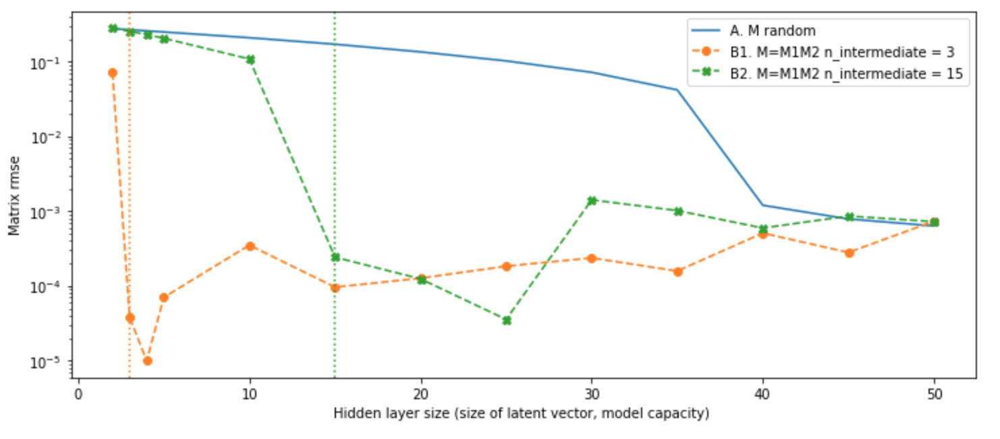

# Matrix Factorization 

Matrix factorization experiment using NN

## Problem

For a given matrix M (m-by-n), find matrices M_1 (m-by-h) and M_2 (h-by-n) so that M ~= M_1 M_2  

## Approach

(See notebook 0)

1. Use a 1-hidden-layer network with h hidden units without activation and bias to represent 
matrix multiplication.
2. Learn the weights by trying to reproduce the matrix elements 

## Experiments

(See notebook 1)

1. Apply this on two cases: 
    1. Completely random M 
    2. Partially random M = M_1 M_2 (where M_1 and M_2 are random, but M is not)
2. The size h that affects the model capacity.

## Result

(See notebook 1)

1. If M is completely random, a larger number of hidden units is needed to reproduce the matrix 
because the pixels are independent.
2. If M is is generated from matrix multiplication, there is a hidden structure that could to be learned.
Therefore fewer free parameters is needed to reprduce/describe the data.  

